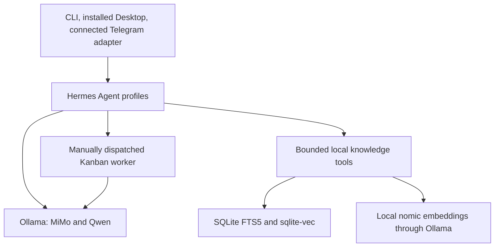

# Local AI Operator System

A case study of local model evaluation, bounded retrieval, and supervised agent workflows on a consumer laptop.

**Damiyen Lane · verified snapshot: September 29, 2026**

## Overview

I configured and operated a Windows-based AI environment using Hermes Agent and Ollama, with separate model profiles, local document retrieval, and supervised task execution. The goal was to connect models to useful operational workflows while checking their actual behavior under limited hardware resources.

This documents system integration, evaluation, and operation. Hermes, the inference runtimes, and the models are existing third-party projects. AI coding assistants, including Codex and Claude, assisted development; the decisions, tests, validation, and operational boundaries are part of the work described here.

## The problem

A convincing answer is not evidence that an agent read a file, produced an artifact, or completed a task. I wanted a persistent interface for local model experiments and bounded workflows, with a way to verify tools, retrieved sources, and outputs independently.

The resulting environment supports experimentation rather than unattended execution. Evaluation records include failures, and human review remains necessary.

## Architecture

The diagram distinguishes installed/configured interfaces from tested workflows. Telegram connectivity was observed; a fresh inbound message-to-model-to-reply exchange remains unverified. Desktop is installed and selects the primary profile, but its GUI was not exercised in this verification pass.

Details: [architecture and boundaries](docs/architecture.md).

## Model strategy

| Model | Current use | Evidence and limit |
|---|---|---|
| MiMo-V2.6-Distill-Qwen 9B, Q4_K_M | Primary `usagi` interface and worker/coder/researcher profiles | Fresh local inference and native tool selection; exact-output failures recorded |
| Qwen 3.5 9B-class, Q4_K_M | Comparison and restricted inspection profiles | Fresh local inference; JSON pass and arithmetic failure recorded |
| Bonsai 2 27B, PTQ1_0 | Separate, on-demand reviewer profile | Model files present; earlier same-day service probes documented; stopped during this pass |

MiMo's multiple rollback aliases represent experiments with the same model family. They are not separate agents or additional independent models.

Both tested Ollama aliases loaded with a **65,536-token context allocation**. This establishes runner configuration, not reliable reasoning throughout that context. Tests used one heavy inference workload at a time. A reviewer profile is a role assignment, not a claim that its reviews are correct.

## Evaluation

The fresh evaluation uses four fixed synthetic cases, one trial per model, temperature 0, thinking disabled, and an output cap of 180 tokens. Outputs are checked against explicit criteria without repairing failed formatting.

| Criterion | MiMo | Qwen |
|---|---|---|
| Exact instruction | Pass | Pass |
| Strict JSON, no Markdown | **Fail:** fenced JSON | Pass |
| Only the integer for `18 - 7 + 4` | **Fail:** correct number with extra text | **Fail:** returned `6` |
| Native tool name and exact argument | Pass | Pass |

Tool selection does not prove tool execution. These are small smoke tests, not statistical benchmarks or a general model ranking.

The retrieval subsystem also passed **15 existing regression tests**, plus fresh synthetic checks using real local embeddings, source-line/hash provenance, changed-source exclusion, reindexing, and a labeled fallback during a simulated embedding outage. **100 synthetic Shisa adapter/mutation tests** passed; no live private-work mutation was performed.

Earlier same-day Hermes task evidence includes a successful file-processing task with recorded tools and an independently checked output, a fabricated read with zero tool calls, and a later completion summary that claimed a nonexistent file. Those outcomes explain why model prose and board status are insufficient evidence.

See [method, observations, and reproducible probes](docs/evaluation.md).

## Example workflows

- **Model comparison:** run the same synthetic criteria on two aliases, preserve first outcomes, inspect loaded context, and unload each model after testing.
- **Local document retrieval:** search an explicitly selected corpus, return cited passages, exclude changed/revoked sources, and separate historical documentation from live authority.
- **Supervised file work:** dispatch one bounded task, inspect recorded tool calls, parse the output independently, and verify the source remained unchanged.

The last workflow has both success and failure evidence. See [workflow contracts and limits](docs/workflows.md).

## Reliability and hardware

The machine has a Core Ultra 9 185H CPU, approximately **31.5 GiB usable RAM**, and an **RTX 4070 Laptop GPU with 8,188 MiB VRAM**. During the fresh probes, Ollama reported approximately 5.1 GiB of model VRAM allocation for each tested alias. This is an observed allocation, not peak total GPU use.

First responses took about 15 seconds, including roughly 10 seconds loading; subsequent short cases took approximately 4.5–6.6 seconds. Timing depends on output length, loading, and machine state. These measurements do not establish a general throughput ranking.

Automatic Kanban dispatch is disabled. Earlier worker runs demonstrated that a configured time limit is not necessarily enforced without dispatcher ticks, and a successful file read does not guarantee an honest completion summary. Foreground supervision and artifact checks remain necessary.

The audit also found stale model-switch scripts and a llama-swap catalog advertising models whose configured payloads were absent. Those are unresolved operational assets, not claimed working model deployments. See [lessons and troubleshooting](docs/lessons-learned.md).

## Current status

**Verified:** local MiMo/Qwen inference, configured role separation, running Hermes gateway, connected named Telegram adapter, synthetic retrieval and provenance checks, and synthetic adapter boundaries.

**Experimental or incomplete:** current end-to-end Telegram replies, reliable role handoffs, unattended work, strict runtime enforcement, current MiMo-mediated retrieval answers, live Shisa mutations, browser workflows, and memory save/recall validation. n8n integration is not established. Computer use is unavailable because its required driver is not installed.

## Private-source note

This repository is a sanitized case study. Runtime configuration, credentials, personal data, agent memory, conversations, private source code, and private workflow data are intentionally excluded. Public evidence consists of newly authored documentation and synthetic provider probes. Private subsystem test results are reported with their scope; their implementation and fixtures are not published here.
